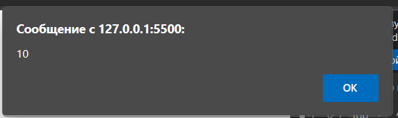
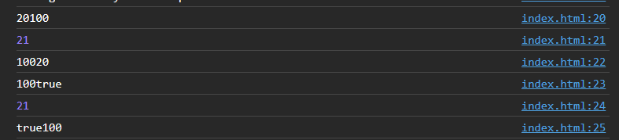
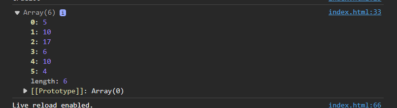
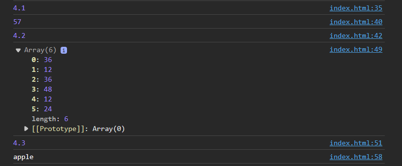

### Задание 1. Работа с переменными

1. Нужно создать переменную `apple` со значением 10
2. Вывести эту переменную с помощью операторов: `alert(); console.log();`
3. Создать переменную `condition`, значение должно быть случайной строкой
4. Посмотреть, что будет при выполнении операции `console.log('Good game is ' + condition)`

### Вопросы

#### 1. Через какой оператор Вы объявили переменую?

```html
    let apple = 10;
```

#### 2. Какие доступны операторы для объявления переменных? В чём их отличия?
1. При помощи `var`. Является устаревшим методом, но можно встретить в legacy коде

```js
var someVariable
```

2. При помощи `let`

```js
let someVariable
```

3. При помощи `const`. Отличие от двух других в том, что нельзя менять значение переменной

```js
const someVariable = 10
```
#### 3. Что происходит при вызове `alert()`?



#### 4. Как Вы думаете для чего может использоваться `console.log()`
 Для вывода логов в консоль разработчика.

 ### Задание 2. Магия конкатенации

1. Создать произвольную целочисленную переменную
2. Создать строковую переменную, которая будет со значением `'100'`
3. Создать произвольную булевую переменную
4. После этого сделать конкатенацию всех этих переменных, вывести в консоль каждую  
   Например: `console.log(someText + someInt)` таких комбинаций должно получиться 6 шт

   ```html
    let my_int = 20;
    let my_string = "100";
    let my_bool = true;
    
    console.log(my_int+my_string);
    console.log(my_int+my_bool);
    console.log(my_string+my_int);
    console.log(my_string+my_bool);
    console.log(my_bool+my_int);
    console.log(my_bool+my_string);
   ```



### Задание 3. работа с массивами

1. Создать массив длинной 10 элементов
2. Заполнить этот массив рандомными числами с помощью оператора `for`
3. Используя метод `filter` убрать из массива числа меньше 0

```html
 let myArray = new Array(10);
    for (let i = 0; i < 10; i++){
       myArray[i] = Math.floor(Math.random() * 41) - 20; 
    }
    myArray = myArray.filter(num => num >= 0);
    console.log(myArray);
```


### Задание 4. Работа с функциями

1. оздать функцию, которая будет возвращать случайное число.
   Проверить работу функции и вывести в консоль

```html
function getRandomNumber() {
    return Math.floor(Math.random() * 100);
    }
    let randomNumber = getRandomNumber();
    console.log(randomNumber);
```
2. Создать функцию, которая будет принимать массив в качестве
   первого параметра, а в качестве второго параметра число.
   Результатом функции будет массив полученный в результате
   умножения второго параметра на каждый элемент массива, полученного в качестве первого параметра
```html
   function multiplyArrayByNumber(array, number) {
    let resultArray = array.map(item => item * number);
    return resultArray;
    }
    let myArray1 = [1, 2, 3, 4, 5];
    let multipliedArray = multiplyArrayByNumber(myArray, 3);
    console.log(multipliedArray);
```
3. Создать анонимную функцию которая будет генерировать случайное слово, вывести в консоль сгенерированное слово
```html
  const generateRandomWord = () => {
    const words = ['apple', 'banana', 'cherry', 'orange', 'grape'];
    const randomIndex = Math.floor(Math.random() * words.length);
    return words[randomIndex];
    };
    const randomWord = generateRandomWord();
    console.log(randomWord);
```

